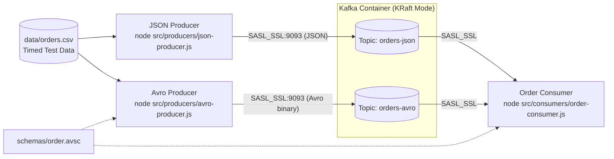

# Kafka Demo Environment

A containerized Apache Kafka demo environment running in **KRaft mode** (single-node, no Zookeeper required) secured with **TLS encryption (SSL)** and **SASL/PLAIN authentication (username & password)**.

The project demonstrates two Node.js event producers emitting order transactions (one in **JSON format**, one in **Avro binary format** with local schema compilation via `avsc`) using a timed CSV dataset, and a unified Node.js consumer that subscribes to both topics and decodes the messages.

---

## Architecture Overview



---

## Project Structure

```
.
├── config/
│   └── kafka_server_jaas.conf   # JAAS SASL/PLAIN credentials configuration for broker
├── data/
│   └── orders.csv               # Test order records with delay_seconds timing column
├── schemas/
│   └── order.avsc               # Avro schema definition for order events
├── scripts/
│   └── generate-certs.sh        # Generates CA, PKCS12 keystore, and truststore
├── secrets/                     # Generated certificates and passwords (mounted into container)
├── src/
│   ├── config/
│   │   └── kafka.js             # Shared KafkaJS client configuration with SASL_SSL & TLS
│   ├── consumers/
│   │   └── order-consumer.js    # Multi-topic consumer with JSON & Avro decoding
│   ├── producers/
│   │   ├── avro-producer.js     # Timed Avro order producer using avsc
│   │   └── json-producer.js     # Timed JSON order producer
│   └── utils/
│       └── csv-reader.js        # CSV parser & relative delay replay utility
├── test/
│   ├── e2e-test.js              # Live end-to-end Kafka broker verification test
│   └── unit-test.js             # Unit tests for CSV reader, JSON & Avro serialization
├── .env.example                 # Environment variables template
├── docker-compose.yml           # Single-node KRaft Kafka broker definition
├── kafka-demo-plan.md           # Implementation plan and tracking document
├── package.json                 # Project scripts and dependencies
└── README.md                    # Project documentation
```

---

## Prerequisites

- [Docker](https://docs.docker.com/get-docker/) & [Docker Compose](https://docs.docker.com/compose/)
- [Node.js](https://nodejs.org/) (v18+ recommended)
- `openssl` and `keytool` (standard on macOS and Linux) to generate certificates

---

## Quick Start Guide

### 1. Install Dependencies & Configure Environment

```bash
# Install Node.js dependencies
npm install

# Copy environment configuration
cp .env.example .env
```

### 2. Generate Security Certificates & Keystores

Run the certificate generation script:

```bash
npm run generate:certs
```

This creates the Certificate Authority (`ca.crt`, `ca.key`), the broker keystore (`kafka.keystore.jks`), and the broker truststore (`kafka.truststore.jks`) in `./secrets/`.

### 3. Start Kafka Container

```bash
npm run start:kafka
```

Check the status:
```bash
docker compose ps
```

To tail the broker logs:
```bash
docker compose logs -f
```

### 4. Run Verification Tests

Run the unit tests (validates CSV reader, JSON serialization, and Avro encoding):
```bash
npm test
```

Run the live end-to-end broker test (connects via SASL_SSL, produces test JSON and Avro messages, and verifies consumption):
```bash
npm run test:e2e
```

---

## Running the Demo

For an interactive demo, open separate terminal windows:

### Terminal 1: Start the Consumer

```bash
npm run consume
```

The consumer connects via SASL_SSL, subscribes to both `orders-json` and `orders-avro`, and logs incoming order events in real time with format detection.

### Terminal 2: Run the JSON Producer

```bash
npm run produce:json
```

Reads rows from [`data/orders.csv`](data/orders.csv) and emits JSON-formatted orders respecting the `delay_seconds` offset from startup.

### Terminal 3: Run the Avro Producer

```bash
npm run produce:avro
```

Reads rows from [`data/orders.csv`](data/orders.csv), serializes them into Avro binary format using [`schemas/order.avsc`](schemas/order.avsc), and publishes them respecting `delay_seconds`.

---

## Data & Schema Specifications

### Test Dataset ([`data/orders.csv`](data/orders.csv))

| customerid | productid | quantity | shopid | delay_seconds |
| :--- | :--- | :--- | :--- | :--- |
| `CUST-1001` | `PROD-LAPTOP-X1` | 1 | `SHOP-NYC-01` | 0 |
| `CUST-1002` | `PROD-MOUSE-W` | 2 | `SHOP-BOS-02` | 2 |
| `CUST-1003` | `PROD-KB-MECH` | 1 | `SHOP-NYC-01` | 3 |
| `CUST-1004` | `PROD-MONITOR-4K` | 2 | `SHOP-SFO-05` | 5 |
| `CUST-1005` | `PROD-HEADSET-PRO` | 1 | `SHOP-CHI-03` | 7 |
| `CUST-1006` | `PROD-USB-HUB` | 3 | `SHOP-SEA-04` | 9 |
| `CUST-1007` | `PROD-STAND-ADJ` | 1 | `SHOP-NYC-01` | 12 |
| `CUST-1008` | `PROD-WEBCAM-HD` | 2 | `SHOP-AUS-06` | 15 |

### Avro Schema ([`schemas/order.avsc`](schemas/order.avsc))

```json
{
  "type": "record",
  "name": "OrderEvent",
  "namespace": "com.demo.orders",
  "fields": [
    { "name": "customerid", "type": "string" },
    { "name": "productid", "type": "string" },
    { "name": "quantity", "type": "int" },
    { "name": "shopid", "type": "string" }
  ]
}
```

---

## Configuration & Credentials

| Parameter | Default | Description |
| :--- | :--- | :--- |
| `KAFKA_BROKERS` | `localhost:9093` | SASL_SSL listener address |
| `KAFKA_USERNAME` | `admin` | SASL/PLAIN username |
| `KAFKA_PASSWORD` | `admin-secret` | SASL/PLAIN password |
| `KAFKA_CA_PATH` | `./secrets/ca.crt` | Path to CA root certificate |
| `TOPIC_ORDERS_JSON` | `orders-json` | Topic for JSON order events |
| `TOPIC_ORDERS_AVRO` | `orders-avro` | Topic for Avro order events |

---

## Teardown & Cleanup

To stop and remove the Kafka container along with volumes:

```bash
npm run stop:kafka
```
